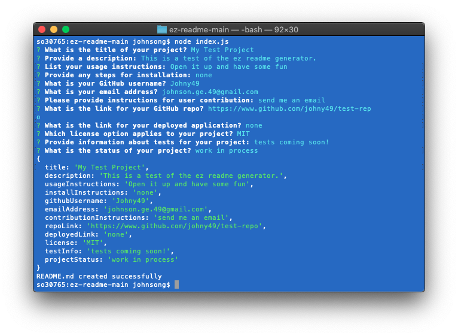

# EZ-README-Generator

## Table of Contents
* [Description](#description)
* [Screenshot](#screenshot)
* [Installation](#installation)
* [Usage](#usage)
* [Link](#link)
* [Code](#code)
* [Contact](#contact)
* [Technologies](#technologies)
* [Project Status](#project-status)

## Description 
This console-based application converts data entered by a user into a formatted README file.

## Screenshot


## Installation
Initialize npm:
```bash
npm init -y
```
Install Inquirer:
```bash
npm -i inquirer
```
Run EZ-README Generator:
```bash
node index.js
```

## Usage
run the following command in the project directory:
```bash
node index.js
```

## Link
[Video Walkthrough](https://johny49.github.io/weather-dashboard/)


## Code
[GitHub Code Repository](https://github.com/Johny49/ez-readme)


## Contact 
Created by [@johny49](https://github.com/Johny49/) - feel free to contact me!


## Technologies
- JavaScript
- Node
- Inquirer.js

## Project Status
Project is: completed and functioning as intended.
